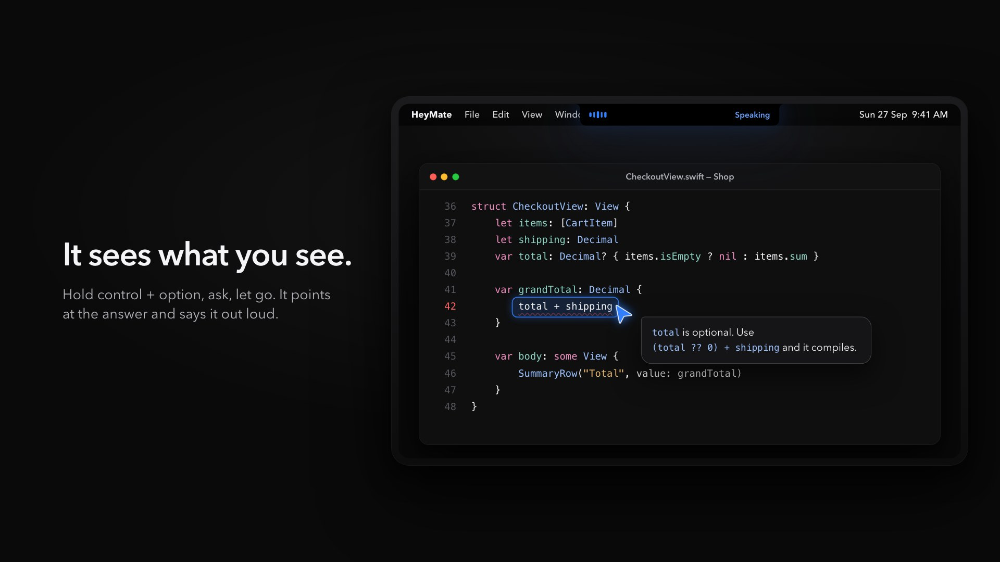
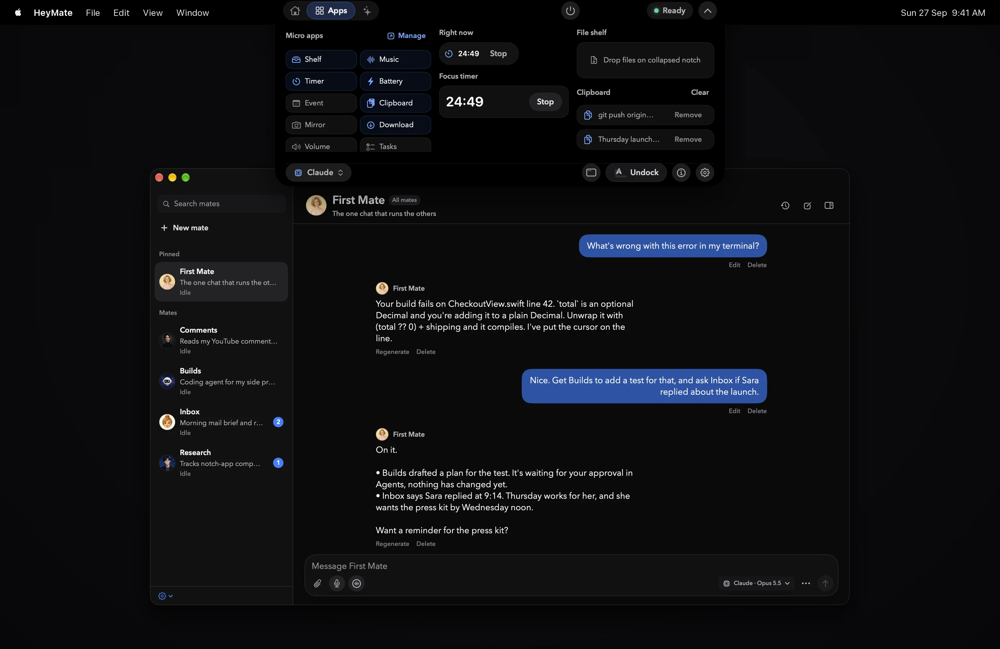
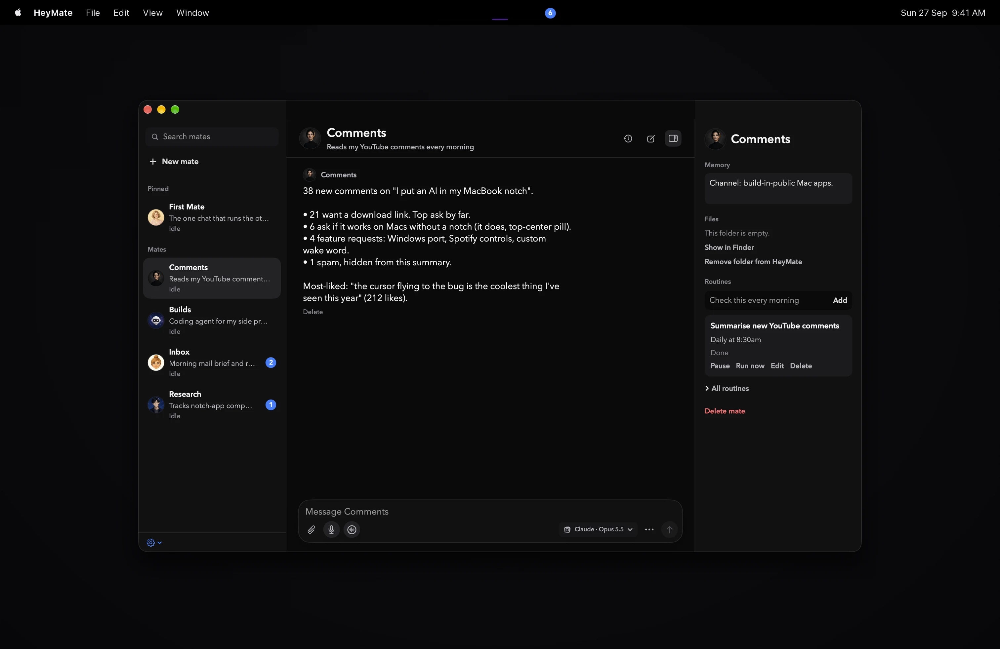
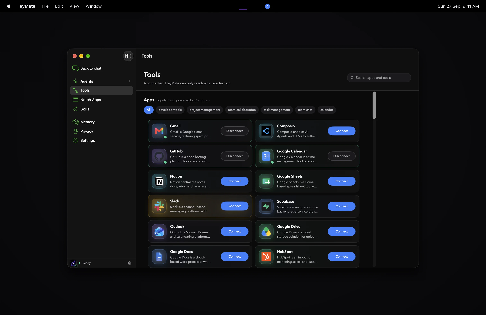

<div align="center">


# HeyMate

**The AI buddy that lives in your Mac's notch.**<br>
Hold a key, ask about anything on your screen, and it answers out loud. It can also hand real coding work to Claude Code, Codex, or OpenCode, running on the subscription you already pay for.

[](https://github.com/UmarSiddiqui/heymate/releases/latest)
[](https://github.com/UmarSiddiqui/heymate/actions/workflows/release.yml)


[](heymate/LICENSE)

[**Download for Mac**](https://github.com/UmarSiddiqui/heymate/releases/latest/download/HeyMate.dmg) · [Website](https://getheymate.vercel.app) · [Watch the demo](https://getheymate.vercel.app/#demo) · [Changelog](https://github.com/UmarSiddiqui/heymate/releases)

<sub>Inspired by <a href="https://github.com/farzaa/clicky">Clicky</a> and <a href="https://github.com/TheBoredTeam/boring.notch">Boring Notch</a>.</sub>

<br>

<a href="https://getheymate.vercel.app/#demo">
  
</a>

<sub>Hold <kbd>⌃</kbd> <kbd>⌥</kbd>, ask "what's wrong with this error?", let go. HeyMate points at the line and says the fix out loud.</sub>

</div>

<br>

## Why HeyMate

- **It sees what you see.** Push to talk, ask about anything on screen, and get an answer out loud. The cursor buddy flies to the thing it is talking about. Screenshots are taken only when a question needs one, and are never stored.
- **It runs on your subscription.** Claude Code, Codex, or OpenCode: whichever CLI you already have installed and signed in. No HeyMate account. No second API bill.
- **It asks before it acts.** Agents plan read-only first. Nothing is written, clicked, or sent without your approval, and every change is snapshotted so you can undo it.

<p align="center">
  <a href="https://getheymate.vercel.app/#demo"></a><br>
  <sub>▶ <a href="https://getheymate.vercel.app/#demo">Watch the 38-second tour</a></sub>
</p>

## Features

<table>
<tr>
<td width="50%" valign="top">

### Lives in the notch
Folds into the camera housing and opens on hover into **Home**, **Apps**, and **Agents**. Macs without a notch get a top-center pill. There is no dock icon and no menu-bar clutter.

Micro-apps for the space you never used: File Shelf with AirDrop, focus timers, Clipboard history, Now Playing with album art, Downloads, Camera Mirror, Volume and Brightness HUDs, Bluetooth devices, Battery, Next Event, and Reminders.

</td>
<td width="50%" valign="top">

</td>
</tr>
<tr>
<td width="50%" valign="top">

</td>
<td width="50%" valign="top">

### Coding agents, on a leash
"HeyMate agent, add dark mode to this project." HeyMate opens a sandbox in `~/Projects/heymate`, has Claude Code or Codex draft a **read-only plan**, and waits. Approve it, walk away, and it keeps running even if you quit.

Undo snapshots, Terminal takeover, completion receipts, and **Standing Orders**: HeyMate proposes work, but never starts it unasked.

</td>
</tr>
<tr>
<td width="50%" valign="top">

### Mates: a small team, not one assistant
"Make me a mate that tracks my YouTube comments." Each mate gets a name, a job, a personality, a face, its own memory, and a workspace folder.

**Routines** run daily at a time you choose or every *N* hours, and results land in that mate's chat.

</td>
<td width="50%" valign="top">

</td>
</tr>
<tr>
<td width="50%" valign="top">

</td>
<td width="50%" valign="top">

### Plugs into what you already use
Apple Calendar, Reminders, Notes, Mail, Messages, and Shortcuts out of the box. Local `gh`, `git`, `docker`, `kubectl`, `vercel`, `supabase`, and `stripe` CLIs with your own logins. Any MCP server, plus 1,400+ toolkits through Composio.

Read-only calls run quietly. Anything that sends, deletes, or pays always asks first.

</td>
</tr>
</table>

## Everything a notch app does, plus an AI

If you use a notch app like [Boring Notch](https://github.com/TheBoredTeam/boring.notch), HeyMate covers every one of its shipped notch features and then adds a buddy that can see your screen, talk back, and do real work.

| | Boring Notch | HeyMate |
| --- | :---: | :---: |
| Now Playing controls, swipe to change track | ✅ | ✅ |
| Album art | ✅ | ✅ |
| Live audio visualizer | ✅ | ✅ |
| Calendar: next event | ✅ | ✅ |
| File shelf with AirDrop | ✅ | ✅ |
| Battery and charging | ✅ | ✅ |
| Volume HUD replacement | ✅ | ✅ |
| Camera mirror | ✅ | ✅ |
| Opens on hover, expands on file drag | ✅ | ✅ |
| Brightness and keyboard-backlight HUD | ✅ | ✅ |
| Bluetooth connect/disconnect activity | ✅ | ✅ |
| Focus timers, clipboard history, downloads, reminders | — | ✅ |
| Push-to-talk questions about your screen, answered out loud | — | ✅ |
| Cursor that points at what it's talking about | — | ✅ |
| Claude Code / Codex / OpenCode agents with plan approval and undo | — | ✅ |
| Mates with memory, workspaces, and schedules | — | ✅ |
| Connectors: Apple apps, local CLIs, MCP, Composio | — | ✅ |
| License | GPL-3.0 | MIT |

<sub>Comparison based on Boring Notch's public README as of September 2026. Not affiliated.</sub>

## Install

1. Paste this in Terminal:

    ```sh
    curl -fsSL https://getheymate.vercel.app/install.sh | bash
    ```

    It downloads the latest build, copies HeyMate into Applications, and opens it. Because `curl` doesn't set macOS's quarantine flag, you won't see "could not verify HeyMate is free of malware". The [script](website/install.sh) is short; read it first if you like.
2. Prefer the DMG? Download **[HeyMate.dmg](https://github.com/UmarSiddiqui/heymate/releases/latest/download/HeyMate.dmg)** and drag HeyMate into Applications. The build is not Developer ID-signed yet, so macOS will block it: open **System Settings → Privacy & Security → Open Anyway**, or run `xattr -dr com.apple.quarantine /Applications/HeyMate.app`.
3. Pick a brain with the model chip, then grant **Microphone**, **Accessibility**, and **Screen Recording** when the setup card asks.
4. Hold <kbd>⌃</kbd> <kbd>⌥</kbd> and say hey.

Every push to `main` is built on GitHub Actions and published as a new [release](https://github.com/UmarSiddiqui/heymate/releases) with its changes listed, so the download link always points to the newest build.

Suggestions, bugs, or trouble installing? Email me at [umarsiddiqui3037@gmail.com](mailto:umarsiddiqui3037@gmail.com?subject=HeyMate).

### Requirements

- macOS 14.2 or later, Apple silicon or Intel
- At least one supported CLI, signed in:

| Brain | Command | Sign in | Notes |
| --- | --- | --- | --- |
| Claude | `claude` | `claude auth login --claudeai` | Default. Uses your Claude subscription, not Console billing. |
| Codex | `codex` | `codex login` | Signing in to the ChatGPT Mac app does not sign in the CLI. |
| OpenCode | `opencode` | `opencode auth login` | Free models need no provider credential. Headless jobs can edit files but cannot run shell commands. |

HeyMate finds CLIs through your login-shell `PATH` (Homebrew, npm, Bun, and `~/.local/bin` included). When Claude or Codex runs a job, HeyMate strips provider API-key and base-URL variables from the child process, so a stray `ANTHROPIC_API_KEY` or `OPENAI_API_KEY` can never switch you to metered billing.

## Privacy

> Nothing runs in the background. HeyMate only takes a screenshot when you press the hotkey, and screenshots are never stored.

- **On your disk.** Chats, memory, mates, and routines live in `~/Library/Application Support/heymate/`, as text only. Memory can be turned off or cleared in Settings.
- **In your Keychain.** Custom-endpoint and connector credentials never touch a HeyMate server, because there isn't one.
- **Excluded apps.** Password managers and System Settings are never captured by Talk, dictation, or screen-reading standing orders.
- **Invisible on calls.** One switch hides the notch and cursor from screen shares.
- **No analytics** unless a build explicitly supplies a PostHog key.

Coding CLIs still run as your macOS user. Plan mode limits writes, not reads.

<details>
<summary><strong>How the coding-agent workflow works</strong></summary>

<br>

A voice or typed request creates a sandbox folder with a `TASK.md`:

1. The selected CLI inspects the task and workspace with writes disabled.
2. HeyMate shows the plan and waits.
3. Approval creates an undo snapshot, resumes the same CLI session, and enables workspace writes.

Sandboxes live at `~/Projects/heymate/<task-slug>-<short-id>`. Choosing an existing folder uses the same plan gate, plus per-tool approval where the CLI supports it.

Approved execution moves into the separately signed `HeyMateAgentRunner` helper embedded at `HeyMate.app/Contents/Helpers`, so work survives Cmd-Q and reattaches on the next launch. Planning is limited to five awake minutes and each execution leg to fifteen; Mac sleep doesn't count. A crash-interrupted run keeps its pre-write undo snapshot.

OpenCode jobs cannot run shell commands or spawn subagents, because its CLI lacks an OS-enforced workspace sandbox. Use Claude Code or Codex when work must build or test itself.

</details>

## Build from source

Requires Xcode 26 and an internet connection on the first build (Swift Package Manager fetches Sparkle, PostHog, and PLCrashReporter).

```bash
git clone https://github.com/UmarSiddiqui/heymate.git
cd heymate/heymate
open leanring-buddy.xcodeproj
```

Select the `leanring-buddy` scheme and **My Mac**, check **Signing & Capabilities** (pick your Personal Team), and press Run. A stable signing identity matters because macOS ties Accessibility and Screen Recording grants to it.

```bash
./scripts/typecheck.sh           # build the app without touching the signed app bundle
./scripts/typecheck.sh --tests   # also build the test targets
./script/build_and_run.sh --verify   # build, launch, and verify a project-local bundle
```

<details>
<summary><strong>Optional services: cloud voices, Custom API, OpenCode Talk</strong></summary>

<br>

**Cloudflare Worker for cloud voices.** [`heymate/worker`](heymate/worker) proxies optional AssemblyAI transcription and ElevenLabs speech. Every route requires a shared `HEYMATE_CLIENT_TOKEN` and fails closed without one. Put provider keys in the git-ignored `heymate/worker/.dev.vars` locally, or in Cloudflare secrets (`npx wrangler secret put HEYMATE_CLIENT_TOKEN`) when deployed. Give the app the same token through its environment or `~/.config/heymate/secrets.env` (`chmod 600` both files). Never put keys in `Info.plist`.

**Custom API.** Accepts any Anthropic Messages-compatible endpoint, model, and optional key (stored in Keychain). It answers Talk requests but doesn't run coding-agent jobs.

**OpenCode Talk.** Run `opencode serve` first. HeyMate defaults to `http://127.0.0.1:4096`. Plain HTTP is allowed only on loopback addresses.

</details>

### Repository layout

| Path | What's there |
| --- | --- |
| [`heymate/leanring-buddy`](heymate/leanring-buddy) | The SwiftUI app |
| [`heymate/leanring-buddyTests`](heymate/leanring-buddyTests) · [`UITests`](heymate/leanring-buddyUITests) | Unit and UI tests |
| [`heymate/worker`](heymate/worker) | Optional Cloudflare Worker for cloud voices |
| [`website`](website) | The landing page |
| [`marketing/demo-video`](marketing/demo-video) | The Remotion project that renders the demo video |
| [`.github/workflows`](.github/workflows) | The build-and-release pipeline |

## Known limitations

- Builds are ad-hoc signed until a Developer ID certificate is set up, so first launch needs Control-click → Open, and automatic updates aren't wired yet.
- Fresh installs default to Claude even if another CLI is the one signed in. Choose the brain before onboarding.
- Screen Recording permission can lag until the next launch after you grant it.
- OpenCode Talk needs `opencode serve` running.

## License

MIT. See [`heymate/LICENSE`](heymate/LICENSE). HeyMate grew out of the MIT-licensed [Clicky](https://github.com/farzaa/clicky) project, and that copyright notice is kept in the license file.

<sub>Not affiliated with Apple, Anthropic, or OpenAI. Claude, ChatGPT, and macOS are trademarks of their respective owners.</sub>
